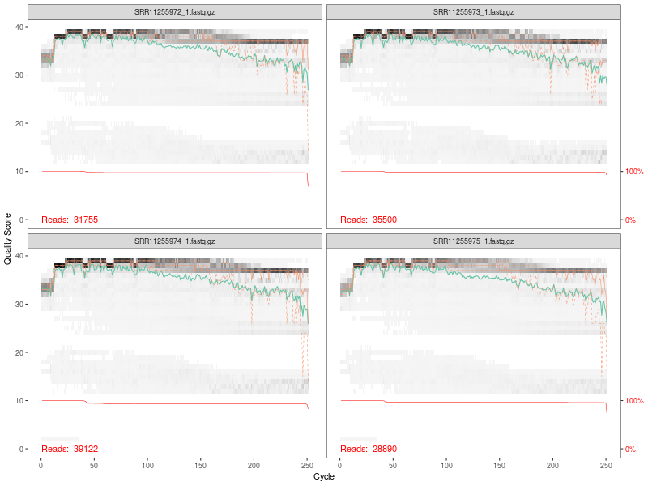
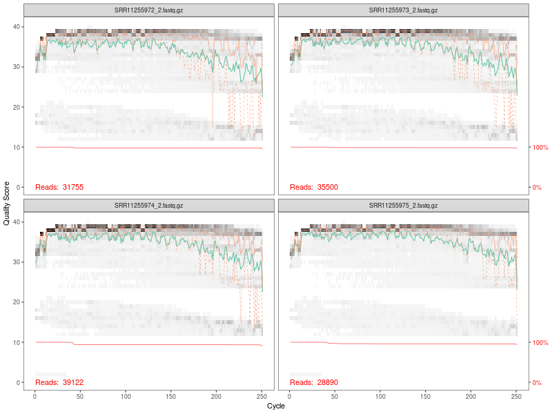
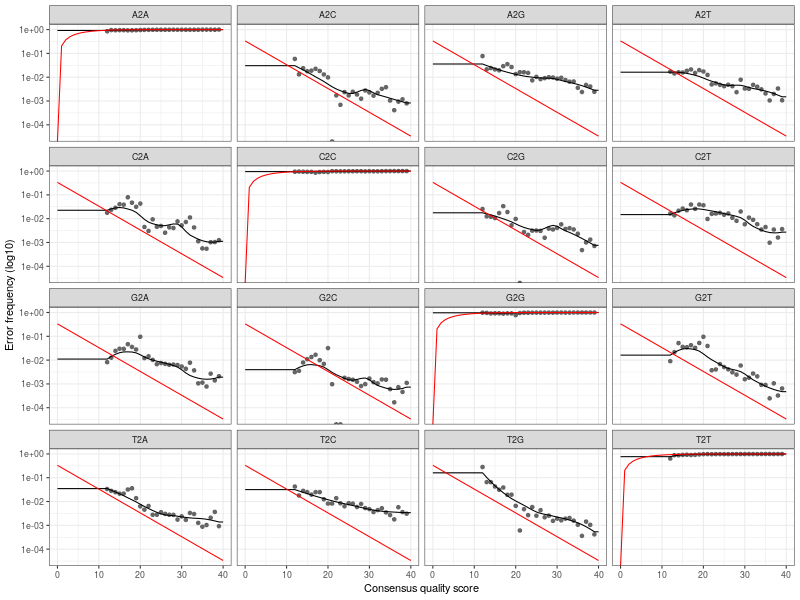
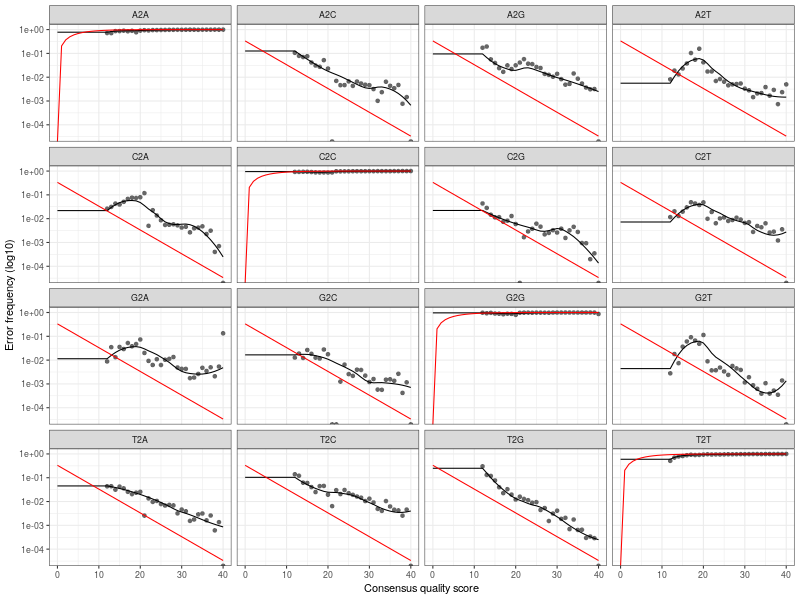

# DADA2 Filtering Report

**Dataset:** PRJNA610838

**Date:**  2026-05-28 09:59:06 

## Quality Assessment

### Forward Reads Quality Profile



Forward reads show good quality throughout, with slight degradation toward the end.

### Reverse Reads Quality Profile



Reverse reads show lower quality compared to forward reads, particularly at the end.

## Filtering Parameters

Based on quality profiles above, the following parameters were used:

```
truncLen = c(240, 180)  # Truncate forward to 240bp, reverse to 180bp
maxN = 0                # No ambiguous bases allowed
maxEE = c(2, 3)         # Max expected errors (forward=2, reverse=3)
truncQ = 2              # Truncate at first Q score < 2
rm.phix = TRUE          # Remove PhiX contamination
```

## Summary Statistics

| Metric | Value |
|--------|-------|
| Total Samples |  10  |
| Mean Reads Input |  36552  |
| Mean Reads Output |  30816  |
| Mean Retention Rate |  84.4 % |
| Min Reads Output |  24054  |
| Max Reads Output |  36448  |


## Error Rate Assessment

Error rates were learned separately for forward and reverse reads using the `learnErrors()` function.

### Forward Error Rates



### Reverse Error Rates



## DADA2 Denoising and ASV Inference

The DADA algorithm was applied to denoise sequences and infer Amplicon Sequence Variants (ASVs).

## Paired-End Read Merging

Forward and reverse reads were merged based on sequence overlap.

## Chimera Removal

Bimeric sequences (chimeras) were removed using the consensus method.

**Sequences retained after chimera removal:**  96.15 %

## Sequence Table Summary

| Metric | Value |
|--------|-------|
| Total Samples |  10  |
| Total ASVs |  31  |
| Mean Reads per Sample |  80  |
| Min Reads in Sample |  0  |
| Max Reads in Sample |  309  |

## Processing Pipeline Tracking

| Sample | Input | Filtered | Denoised | Merged | Non-Chim |
|--------|-------|----------|----------|--------|----------|
| SRR11255972 | 31755 | 27226 | 26913 | 87 | 87 |
| SRR11255973 | 35500 | 30675 | 30044 | 51 | 51 |
| SRR11255974 | 39122 | 31844 | 31434 | 79 | 78 |
| SRR11255975 | 28890 | 24054 | 23456 | 340 | 309 |
| SRR11255976 | 31906 | 27579 | 26338 | 0 | 0 |
| SRR11255977 | 39116 | 32903 | 32675 | 46 | 46 |
| SRR11255978 | 41258 | 32672 | 32368 | 85 | 85 |
| SRR11255979 | 35452 | 30222 | 29805 | 140 | 140 |
| SRR11255980 | 41730 | 36448 | 32899 | 4 | 4 |
| SRR11255981 | 40788 | 34534 | 34315 | 0 | 0 |
